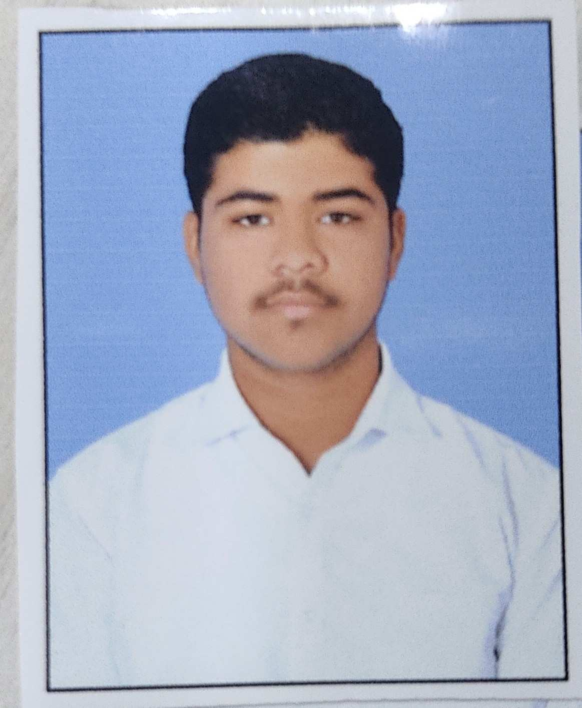

# Abed Kazi — Digital Portfolio

### About Me
B.Tech Engineering Student at **MIT Vishwaprayag University** (Class of 2026).  
Passionate about **Physics**, **Chemistry**, and **Artificial Intelligence**.

### My Certificates
This portfolio showcases my 7 certificates:

- Engineering Physics Prerequisites
- Revisiting Chemistry
- Introduction to Modern AI
- Yuva AI for All
- SkillSpardha Workshop
- AI for All (Ai4A)
- Design Thinking Workshop

### How to View
Visit the live portfolio here:  
👉 **[https://abed1kazi2.github.io/Project-Aoi/](https://abed1kazi2.github.io/Project-Aoi/)**

### Files in Repository
- `index.html` → Main portfolio page
- `photo.jpg` → Profile photo
- `cert1.jpg` to `cert7.jpg` → Certificate images

---

Built with ❤️ using HTML & CSS  
Made for showcasing academic achievements and certificates.
